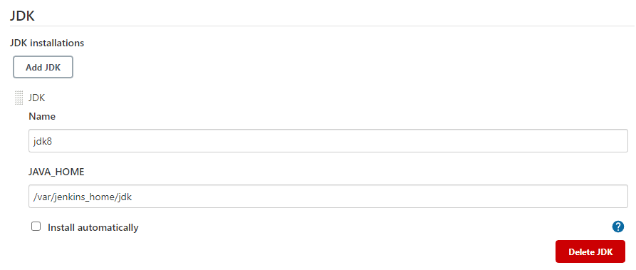
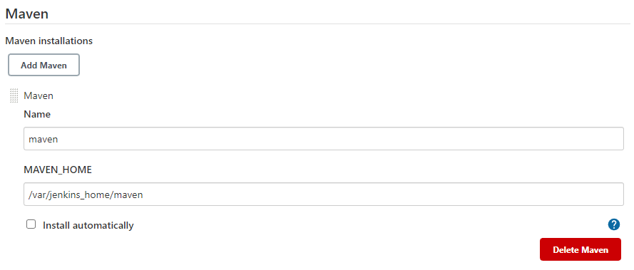
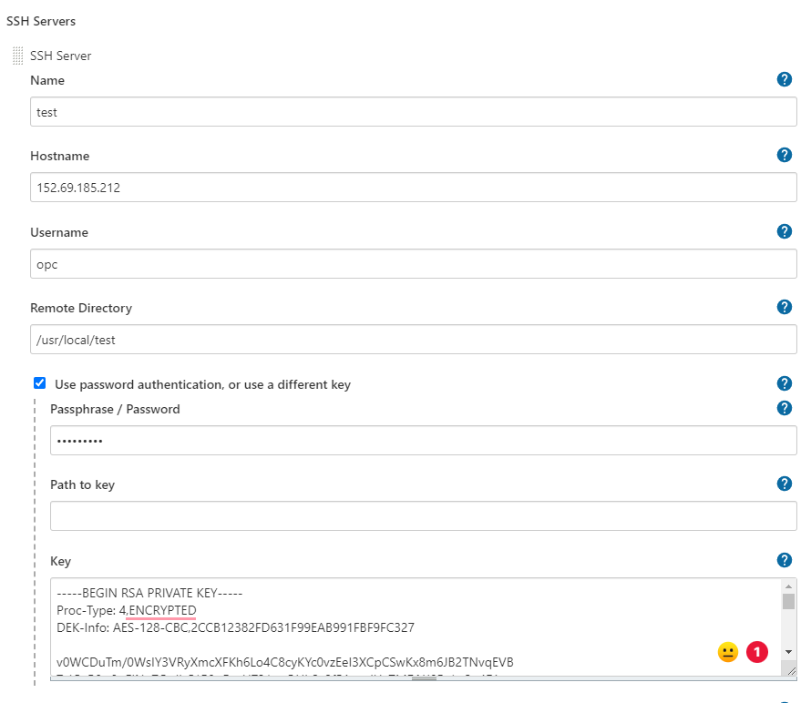

# CI/CD

## 1. 连接linux主机

### 1.1 安装openssh-server包
```shell
sudo apt-get install openssh-server
```

### 1.2 启动ssh server
```shell
sudo /etc/init.d/ssh start
```

### 1.3 确认ssh服务启动
```shell
ps -e | grep ssh
```

### 1.4 设定服务端口，设置完后重启服务（非必须）
```shell
sudo vi /etc/ssh/sshd_config
sudo /etc/init.d/ssh restart
```

### 1.5 使用windows连接
在windows上输入linux主机IP和用户名+密码


## 2. 安装配置linux

### 2.1 安装jdk8
```shell
tar -zxvf jdk-8u333-linux-aarch64.tar.gz -C /usr/local
```

### 2.2 安装maven
```shell
tar -zxvf apache-maven-3.8.6-bin.tar.gz -C /usr/local
```

### 2.3 改文件名
```shell
cd /usr/local
mv jdk1.8.0_333 jdk
mv apache-maven-3.8.6 maven
```

### 2.4 修改settings.xml，配置maven私服，配置jdk编译插件
```shell
cd maven/conf   
```
+ 找到mirror标签，更换为阿里云maven镜像
+ 找到</profiles>标签，在它上面加入 jdk1.8编译插件，改名jdk8 
+ 找到<activeProfiles>标签，复制粘贴到注释外面，保留一个activeProfile，改名jdk8

### 2.5 安装docker
```shell
curl -fsSL https://get.docker.com | bash -s docker --mirror Aliyun
systemctl start docker.service
```

### 2.6 启动docker服务，设置开机启动
```shell
systemctl start docker
systemctl enable docker
```

### 2.7 安装docker-compose
```shell
curl -L https://github.com/docker/compose/releases/download/1.23.2/docker-compose-`uname -s`-`uname -m` -o /usr/bin/docker-compose
chmod +x /usr/bin/docker-compose
```


## 3. 安装Gitlab

### 3.1 拉取镜像
```shell
docker pull gitlab/gitlab-ce
```

### 3.2 创建docker-compose.yaml路径
```shell
cd /usr/local
mkdir docker
cd docker
mkdir gitlab_docker
cd gitlab_docker
```

### 3.3 创建docker-compose.yaml，修改ip
```yaml
version: '3.1'
services:
  gitlab:
    image: 'gitlab/gitlab-ce'
    container_name: gitlab
    restart: always
    environment:
      GITLAB_OMNIBUS_CONFIG: |
        external_url 'http://192.168.0.137:8929'
        gitlab_rails['gitlab_shell_ssh_port'] = 2224
    ports:
      - '8929:8929'
      - '2224:2224'
    volumes:
      - './config:/etc/gitlab'
      - './logs:/var/log/gitlab'
      - './data:/var/opt/gitlab'
```

### 3.4 启动gitlab
```shell
cd /usr/local/docker/gitlab_docker
docker-compose up -d
```

### 3.5 登录gitlab，查看root帐号密码
http://192.168.0.137:8929
```shell
docker exec -it gitlab bash
cat /etc/gitlab/initial_root_password
```


## 4. Jenkins

### 4.1 拉取镜像
```shell
docker pull jenkins/jenkins
docker pull jenkins/jenkins:2.319.3-lts
```

### 4.2 创建docker-compose.yaml路径
```shell
cd /usr/local/docker
mkdir jenkins_docker
cd jenkins_docker
```

### 4.3 配置docker-compose.yaml
```yaml
version: '3.1'
services:
  jenkins:
    image: 'jenkins/jenkins:2.319.3-lts'
    container_name: jenkins
    restart: always
    ports:
      - '8080:8080'
      - '50000:50000'
    volumes:
      - './data:/var/jenkins_home'
```

### 4.4 启动jenkins
```shell
cd /usr/local/docker/jenkins_docker
docker-compose up -d
```

### 4.5 赋予宿主机jenkins data目录权限，重启容器
```shell
chmod -R 777 data
docker-compose restart
```

### 4.6 查看jenkins日志
```shell
docker logs -f jenkins
```

### 4.7 找到日志里的密码，浏览器中访问jenkins，输入密码
在`Please use the following password to proceed to installation:`后面

### 4.8 手动安装插件
选择手动安装，根据提示操作。如果失败，进入面板后找到`Mange Jenkins`→`Manage Plugins`→`Available`，手动安装<br/>
总是不成功，就更改为国内的插件源。<br/>
必装插件:
+ Github Parameter
+ Publish Over SSH

### 4.9 挂载jdk和maven
```shell
mv /usr/local/jdk /usr/local/docker/jenkins_docker/data
mv /usr/local/maven /usr/local/docker/jenkins_docker/data
```
回到浏览器jenkins的`Dashboard`→`Global Tool Configuration`→`Add JDK`，取消自动安装，按下图填写。



`Add Maven`



### 4.10 连接代码仓库
`Dashboard`→`Configure System`，找到`Publish over SSH`，点击`Add`


这个username是远程服务器的username，密码和私钥也是连接那个服务器用的。

`Test Configuration`测试是否跑通，联通则保存。


## 5. CI流程
