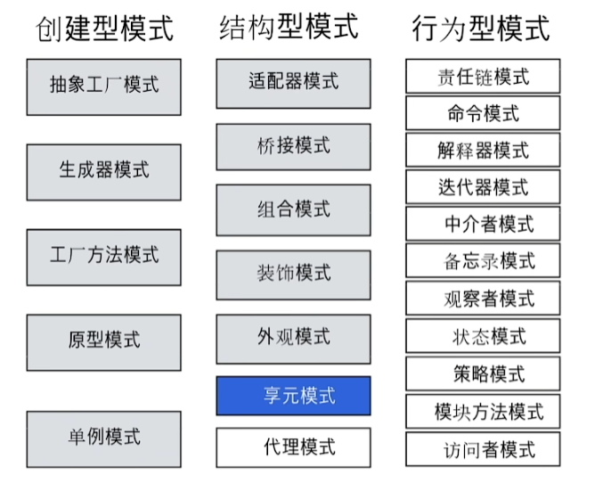

# 设计模式

> 鸣谢 欢喜（B站：面向加薪学习）

<!-- TOC -->
* [设计模式](#)
    * [1. 单例模式](#1-)
    * [2. 观察者模式](#2-)
    * [3. 组合模式](#3-)
    * [4. 策略模式](#4-)
    * [5. 装饰器模式](#5-)
    * [6. 状态模式](#6-)
    * [7. 工厂模式](#7-)
    * [8. 抽象工厂模式](#8-)
    * [9. 外观模式](#9-)
    * [10. 建造者模式](#10-)
    * [11. 桥接模式](#11-)
    * [12. 命令模式](#12-)
    * [13. 迭代器模式](#13-)
    * [14. 模板模式](#14-)
    * [15. 访问者模式](#15-)
    * [16. 备忘录模式](#16-)
    * [17. 责任链模式](#17-)
    * [18. 中介模式](#18-)
    * [19. 原型模式](#19-)
    * [20. 享元模式](#20-)
    * [21. 解释器模式](#21-)
    * [22. 适配器模式](#22-)
    * [23. 代理模式](#23-)
<!-- TOC -->

---


## 1. 单例模式

**定义**：某结构体只有一个对象

**实现**：利用sync.Once的Do方法创建对象，使用函数方式获取此对象

**场景**：定义上下文对象

## 2. 观察者模式

**定义**：主体发布消息（事件）后，注册过的观察者会执行某事，同时会读取所发布消息的内容

**实现**：主体持有观察者的列表和对列表元素修改的方法（注册方法），观察者持有针对事件的执行方法，
其参数是事件，主体调用通知函数时，会遍历其观察者列表，各个观察者调用其执行事件的方法，并将事件作为参数传入。

**场景**：事件驱动模型，监听数据，双向绑定

## 3. 组合模式

**定义**：组合体执行方法，其各个组合个体都会调用同名的方法

**实现**：某组件持有其他组件形成list，形成组合体，定义实现接口，遍历list并执行接口函数。

**场景**：树形结构中各节点统一执行

## 4. 策略模式

**定义**：让对象执行不同的操作

**实现**：对象可set不同策略对象，对象执行方法时，先引用传入的策略对象，再执行策略对象的方法，策略对象的方法的参数可由主对象执行方法传入。

**场景**：if情况过多（例如：商家有多种促销方式）

## 5. 装饰器模式

**定义**：包装函数A，在包装袋里调用其他函数B，使执行A时执行B

**实现**：利用闭包，定义一个包裹函数C（参数是被包裹的函数名A和持有函数B的对象Obj），返回函数D（参数是A的参数，返回值是A的返回值），
在D内部定义函数E（参数是A的参数，返回值是A的返回值），函数E内部会执行A和Obj的某个方法，
可通过defer调整执行顺序（如果没有返回值可以不使用defer），让函数B在A调用前或后执行。在函数D内部执行E。
由于D被C返回给主程序某变量，所以在D没有执行前，E不会被执行。当执行被C返回的D时，E被D在内部调用，从而使AB在E中被执行。

```go
func WrapLogger(fun PiFunc, logger *log.Logger) PiFunc {   //C
    return func(n int) float64 {  //D
        fn := func(n int) (result float64) {  //E
            defer func(t time.Time) {
                logger.Printf("took=%v, n=%v, result=%v", time.Since(t), n, result) //Obj的B
            }(time.Now())
            return fun(n) //A
        }
        return fn(n)
    }
}
```
```go
foo := WrapLogger(Pi, log.New(os.Stdout, "test", 1))
foo(10000)
```

**场景**：AOP，日志

## 6. 状态模式

**定义**：用于切换对象的状态，来匹配不同的属性和接口

**实现**：
1. 建立状态机，初始化状态
2. 设置状态的通用接口
3. 设置不同状态的属性和方法
4. 设置不同状态的方法的切换状态的功能

**场景**：开关（例如限流开关），对象需要切换状态时都可使用。

## 7. 工厂模式

**定义**：使用函数创建对象

**实现**：
1. 定义接口
2. 定义实现接口的对象，并实现接口
3. 定义创建对象的函数，返回实现该接口的对象
4. 调用函数，创建实现该接口的对象

**场景**：根据参数创建对象

## 8. 抽象工厂模式

**定义**：使用函数创建可调用函数创建对象的对象（创建工厂的工厂）

**实现**：
1. 实现创建对象的工厂
2. 定义抽象工厂的接口
3. 定义创建抽象工厂的函数，返回抽象工厂
4. 利用抽象工厂的接口创建普通工厂，实现创建工厂的接口

**调用**：
1. 调用函数，创建抽象工厂
2. 再通过调用抽象工厂的接口，创建普通工厂对象
3. 使用对象方法

**场景**：
1. 不再使用参数作为创建普通工厂的依据，而是通过抽象工厂的接口来创建不同的普通工厂
2. 在参数种类繁多的时候，避免了条件判断，增强代码可读性，易于维护

## 9. 外观模式

**定义**：隐藏内部处理过程，只对外暴露可用方法，相当于前台

**实现**：在对外方法中，实现整个流程

**场景**：使用者不需要知道内部过程的时候

## 10. 建造者模式

**定义**：利用建造者方法，构建实例对象，并初始化属性。实例不含有配置属性的方法，只有功能性方法。

**优点**：
1. 不再受多个参数的影响，不需要写多个重载方法
2. 不再对外暴露set方法

**实现**：
1. 构造创建builder的函数，设置初始化必填的参数
2. 构造set函数，设置初始化非必填参数
3. 为builder构造build方法，用于创建对象，builder是谁的builder就创建谁
4. 注意链式调用

**场景**： 多参数设置和复杂校验，例如消息队列初始化

## 11. 桥接模式

**定义**：将一个复杂的类中的属性或方法按某种形式分类，并以多态注入的形式桥接

**优点**：
1. 抽象和实现的分离
2. 优秀的扩展能力
3. 实现细节对客户透明

**实现**：
1. 建立构造体，一部分属性或方法在内部，一部分以注册接口方式传入
2. 调用已注册的接口，完成功能

**场景**：复杂构造体功能拆分

## 12. 命令模式

**定义**：将函数定义包裹在数据中，通过调用执行函数，来触发定义在数据中的函数的执行

**优点**：降低系统的耦合度，增加新的命令很方便

**实现**：
1. 发布命令者持有保存命令对象的键值对
2. 命令对象持有调用传入命令函数的执行方法
3. 命令者执行命令函数时，会调用其存储的命令对象的执行方法，从而调用命令
4. 命令的链式情况是由于每个命令函数都会调用其存储的命令对象的执行方法，没有则终止

**场景**：命令队列和宏命令，并方便地实现对请求的撤销和恢复

## 13. 迭代器模式

**定义**：按索引顺序访问下一个元素

**实现**：
1. 取索引
2. 取值
3. 判断索引与值是否对应
4. 判断是否有下一个数据
5. 返回下一个数据

**场景**：顺序访问有序集合，且不需要知道有序集合内部结构

## 14. 模板模式

**定义**：行为具备模板性（接口），通过注册需要执行模板行为的对象，让对象执行模板行为

**实现**：
1. 模板行为接口
2. 实现接口的对象，多态传入构造函数，相当于注册该对象
3. 调用模板方法(Daily)，执行模板行为

**场景**：行为统一，执行对象不同

## 15. 访问者模式

**定义**：被操作对象需接受操作对象的访问，才能修改被操作对象

**实现**：
1. 被操作对象访问函数传入访问对象
2. 可在被操作对象中加入判断来拒绝访问对象，也可以是接口对象
3. 访问函数中执行修改被操作对象的功能

**场景**：数据结构与数据操作分离，简单拦截器，简单过滤器

## 16. 备忘录模式

**定义**：保存对象的某个状态，方便以后查看

**实现**：需要存入备忘录时，存入备忘录对象

**场景**：统计，存档，事务管理

## 17. 责任链模式

**定义**：一条链上的每个节点都去处理请求，一个处理完传递到下一个，直到处理完毕

**实现**：
1. 利用next属性，组成链
2. 处理中可以结束链，也可以调用注册于next的方法向下传递
3. 注意没有next时，链的终止

**场景**：拦截器，过滤器

## 18. 中介模式

**定义**：两对象通过中间对象通信

**实现**：
1. 设置中间对象
2. 注册中介
3. 在需要通信的对象方法内部调用中介的方法

**场景**：消息队列

## 19. 原型模式

**定义**：通过接口创建与当前对象相同的对象

**实现**：
1. 对象持有clone方法
2. clone方法会保存当前receiver的值

**场景**：创建重复对象，通过克隆保存对象的某个状态

## 20. 享元模式

**定义**：共享元信息，不会重复建立对象，而是通过共享元信息来调用已创建的对象来使用

**实现**：
1. 一个存储可变信息，factory存储不变信息
2. 在调用时组合信息

**场景**：对象有可变和不变两部分属性且占内存过大

## 21. 解释器模式

**定义**：解释表达式

**实现**：
1. 建立表达式对应关系映射
2. 遍历表达式

**场景**：编译器

## 22. 适配器模式

**定义**：可以通过适配器接口调用被适配的接口

**实现**：在适配器的执行方法中，调用被适配的接口

**场景**：接口兼容性处理

## 23. 代理模式

**定义**：由代理对象执行方法

**实现**：在代理对象方法中，调用被代理的对象的接口

**场景**：
1. 远程代理
2. 虚拟代理
3. Copy-on-Write 代理
4. 保护（Protect or Access）代理
5. Cache代理
6. 防火墙（Firewall）代理
7. 同步化（Synchronization）代理
8. 智能引用（Smart Reference）代理

**注意**：
1. 和适配器模式的区别：适配器模式主要改变所考虑对象的接口，而代理模式不能改变所代理类的接口。 
2. 和装饰器模式的区别：装饰器模式为了增强功能，而代理模式是为了加以控制。
