# Golang

<!-- TOC -->
* [Golang](#golang)
  * [1. array和slice](#1-arrayslice)
  * [2. Channel](#2-channel)
  * [3. 锁](#3-)
  * [4. 优雅的main](#4-main)
  * [5. 内存分配](#5-)
    * [内存分配总结](#)
  * [6. GC（未完成）](#6-gc)
    * [GC流程](#gc)
  * [7. GPM（未完成）](#7-gpm)
  * [8. runtime包](#8-runtime)
  * [9. reflect包](#9-reflect)
    * [结构体反射](#)
  * [10. context包](#10-context)
  * [11. atomic包](#11-atomic)
  * [12. 性能调优](#12-)
  * [13. 浏览器跨域](#13-)
<!-- TOC -->

---

## 1. array和slice
|     | array | slice                   |
|:---:|:------|:------------------------|
| 类型  | 值类型   | 引用类型                    |
| 内存  | 存值    | 存切片所切数组的头部地址、len、cap    |
| 传参  | 值传递   | 引用传递                    |
| 扩容  | 不可    | 小于1024扩1/2，大于等于1024扩1/4 |

作为参数传入函数时，array传入的是拷贝，是值传递，slice传入的是指针，是引用传递。<br/>
因此对参数（array）的操作会不改变原array，对参数（slice）的操作会改变原slice <br/>
slice扩容超过其定义的cap，会造成内存逃逸。
```go
arr1 := [3]int{1, 2, 3}
arr2 := [3]int{1, 2, 3}
fmt.Println(arr1 == arr2) // true
```
```go
slice1 := []int{1, 2, 3}
slice2 := []int{1, 2, 3}
fmt.Println(slice1 == slice2) // false
```

## 2. Channel
| 无缓存                       | 有缓存                          |
|:--------------------------|:-----------------------------|
| `ch := make(chan string)` | `ch := make(chan string, 1)` |
| 同步                        | 异步                           |
+ 给没人接收数据的chan发送数据，永久阻塞
+ 从没人发送数据的chan接收数据，永久阻塞
+ 给已经关闭的chan发送数据，panic
+ 从已经关闭的chan接收数据，无缓存，返回nil
+ 从已经关闭的chan接收数据，有缓存，返回零值

## 3. 锁
+ sync.Mutex 互斥锁（悲观锁） `locker := &sync.Mutex{}`
+ sync.RWMutex 读写锁 `locker := &sync.RWMutex{}`
  + 读锁（共享锁） `locker.RLock()` `locker.RUnlock()`
  + 写锁（排他锁） `locker.Lock()` `locker.Unlock()`
+ 自旋锁：自旋锁是指当一个线程在获取锁的时候，如果锁已经被其他线程获取，那么该线程将循环等待，然后不断地判断是否能够被成功获取，知直到获取到锁才会退出循环。
  获取锁的线程一直处于活跃状态，但是并没有执行任何有效的任务，使用这种锁会造成busy-waiting。
  它是为实现保护共享资源而提出的一种锁机制。其实，自旋锁与互斥锁比较类似，它们都是为了解决某项资源的互斥使用。无论是互斥锁，还是自旋锁，在任何时刻，最多只能由一个保持者，也就说，在任何时刻最多只能有一个执行单元获得锁。但是两者在调度机制上略有不同。**对于互斥锁，如果资源已经被占用，资源申请者只能进入睡眠状态。但是自旋锁不会引起调用者睡眠，如果自旋锁已经被别的执行单元保持，调用者就一直循环在那里看是否该自旋锁的保持者已经释放了锁**，“自旋”一词就是因此而得名。

互斥锁与读写锁的具体比较：
+ 独占性：
  + 互斥锁是完全独占的，一次只能一个线程访问资源。
  + 读写锁的读锁是共享的，写锁是独占的。
+ 并发性：
  + 互斥锁在任何情况下都只允许一个线程访问资源，限制了并发性。
  + 读写锁允许多个读线程同时访问，提高了并发性能，但写操作仍需要独占。
+ 复杂性：
  + 互斥锁机制相对简单，使用和管理都比较直接。
  + 读写锁机制复杂度较高，需要考虑读写操作的协调和优先级问题。

```go
//不支持冲入的自旋锁的实现
type spinLock uint32
func (sl *spinLock) Lock() {
    for !atomic.CompareAndSwapUint32((*uint32)(sl), 0, 1) { //自旋
        runtime.Gosched()
    }
}
func (sl *spinLock) Unlock() {
    atomic.StoreUint32((*uint32)(sl), 0)
}
func NewSpinLock() sync.Locker {
    var lock spinLock
    return &lock
}
```
>更多自旋锁介绍 https://studygolang.com/articles/16480

## 4. 优雅的main
截取自iep2021s2be项目app.go
```go
func Launch(ctx context.Context, opts ...Option) {
	cfg := config.GetInstanceOfConfig()
	clean := Init(ctx, opts...)
	logger.WithFields(logger.Fields{
		"app_name":         cfg.App.AppName,
		"version":          cfg.App.Version,
		"pid":              os.Getpid(),
		"protocol":         cfg.Http.Protocol,
		"protocol_version": cfg.Http.ProtocolVersion,
		"host":             cfg.Http.Host,
		"port":             cfg.Http.Port,
	}).Info("Service launched.")
	state := 1
	sc := make(chan os.Signal, 1)
	signal.Notify(sc, syscall.SIGHUP, syscall.SIGINT, syscall.SIGTERM, syscall.SIGQUIT)
LOOP:
	for {
		sig := <-sc
		logger.WithContext(ctx).Infof("Interrupt received [%s]", sig.String())
		switch sig {
		case syscall.SIGQUIT, syscall.SIGTERM, syscall.SIGINT:
			state = 0
			break LOOP
		case syscall.SIGHUP:
		default:
			break LOOP
		}
	}
	defer logger.WithContext(ctx).Infof("Server is shutting down.")
	defer time.Sleep(time.Second)
	defer os.Exit(state)
	defer clean()
}
```

## 5. 内存分配
内存逃逸（栈->堆）：<br/>
golang程序变量会携带有一组校验数据，用来证明它的整个生命周期是否在运行时完全可知。如果变量通过了这些校验，它就可以在栈上分配。否则就说它 逃逸 了，必须在堆上分配。<br/>
+ **在方法内把局部变量指针返回** 局部变量原本应该在栈中分配，在栈中回收。但是由于返回时被外部引用，因此其生命周期大于栈，则溢出。
+ **发送指针或带有指针的值到 channel 中** 在编译时，是没有办法知道哪个 goroutine 会在 channel 上接收数据。所以编译器没法知道变量什么时候才会被释放。
+ **在一个切片上存储指针或带指针的值** 一个典型的例子就是 []*string 。这会导致切片的内容逃逸。尽管其后面的数组可能是在栈上分配的，但其引用的值一定是在堆上。
+ **slice 的背后数组被重新分配了，因为 append 时可能会超出其容量( cap )** slice 初始化的地方在编译时是可以知道的，它最开始会在栈上分配。如果切片背后的存储要基于运行时的数据进行扩充，就会在堆上分配。
+ **在 interface 类型上调用方法** 在 interface 类型上调用方法都是动态调度的 —— 方法的真正实现只能在运行时知道。想像一个 io.Reader 类型的变量 r , 调用 r.Read(b) 会使得 r 的值和切片b 的背后存储都逃逸掉，所以会在堆上分配。

内存对齐：基于OS位数，32位4字节对齐，64位8字节对齐。<br/>
比如32位系统，内存存了一个int8，会占一个字节，下一次内存分配的时候会比较是否占满剩余字节（int8是1个字节，要看剩下3个字节）。
+ 此时传入int16（2个字节），则没有占满4个字节，所以int8和int16不需对齐，地址是连续的，字节长度合计为3
+ 此时传入int32（4个字节），则加上int8会超过4个字节，根据内存对齐，int32会被分配到下4个字节，地址不连续，字节长度合计为8

>Go的内存管理是借鉴 tcmalloc（thread-caching-malloc) 实现的

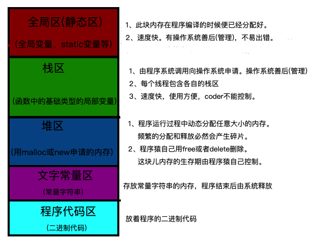
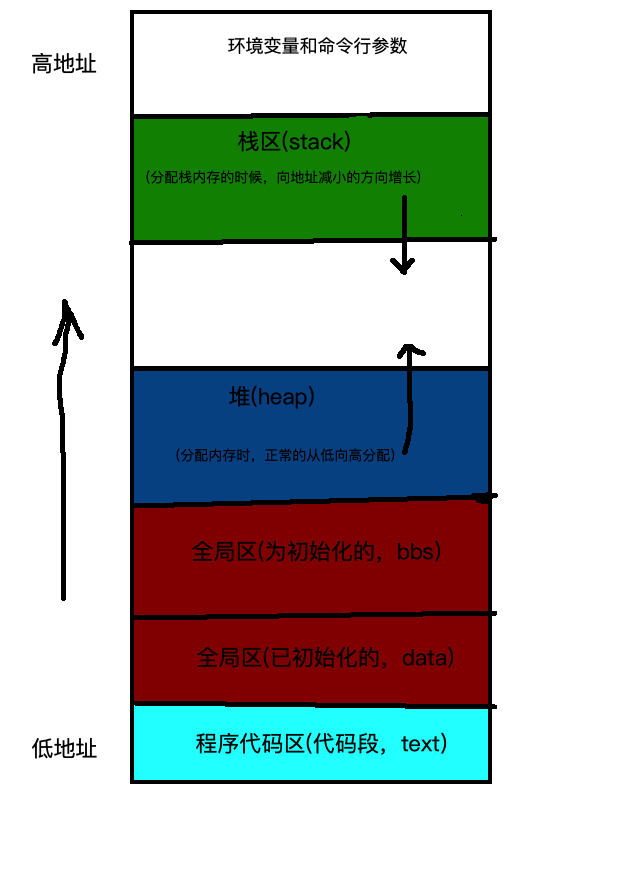

**Go的内存结构**<br/>
Go在程序启动的时候，会分配一块连续的内存(虚拟内存)。

`spans`和`bitmap`的大小会随着`arena`(heap)的改变而改变。
+ `arena`就是常说的heap。由连续的页`page`组成（管理角度）（平常说的存储多个对象，是使用角度）。
+ `spans`是管理分配`arena`(heap)的区域。此区域存放了`mspan`的指针。`spans`区域用于表示`arena`区中的某一页(`page`)属于哪个`mspan`。
+ `bitmap`主要的作用还是服务于GC。有好几种:`Stack`, `data`, and `bss bitmaps`，再就是这次要说的`heap bitmaps`。在此`bitmap`的做作用是标记标记`arena`(即heap)中的对象。一是的标记对应地址中是否存在对象，另外是标记此对象是否被`gc`标记过。一个功能一个bit位，所以，`heap bitmaps`用两个bit位。

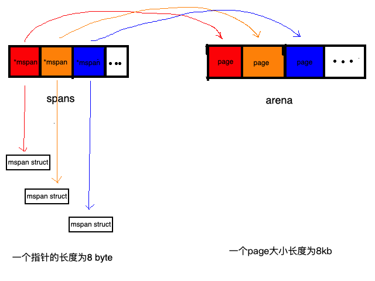

go将内存块分为大小不同的67种，然后再把这67种大内存块，逐个分为小块(可以近似理解为大小不同的相当于`page`)称之为`span`(连续的`page`)，在go中就是上文提及的`mspan`。<br/>
对象分配的时候，根据对象的大小选择大小相近的span，这样，碎片问题就解决了。

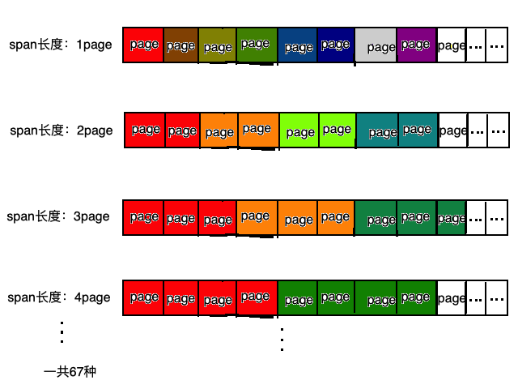

`bitmap`的地址是由高地址向低地址增长的。

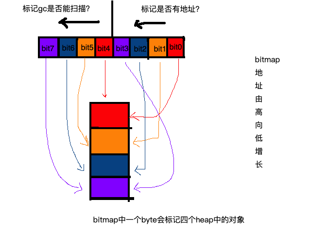
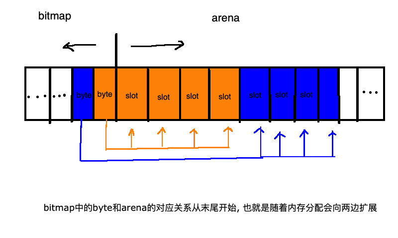

`mspan`是go中内存管理的基本单元。<br/>
`mspan`是双向链表，其结构体属性为:
+ 双向链表所需的`next`和`prev`两个指针
+ 一共有多少块`span`
+ 哪些`span`使用了，哪些没有用
+ `span`的类型是什么（67种的哪一个）
+ 管理的页数（`pages`）

`mcache`： 为了避免多线程申请内存时不断的加锁，goroutine为每个线程分配了`span`内存块的缓存，这个缓存即是`mcache`，每个`goroutine`都会绑定的一个`mcache`，各个`goroutine`申请内存时不存在锁竞争的情况。`mcache`在`GPM`的`P`中，所以没有锁竞争。

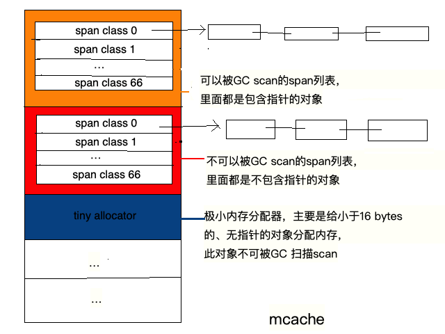

`mcentral`：为所有`mcache`提供切分好的`mspan`。有多少种类型(67)的`mspan`就有多少个`mcentral`。<br/>
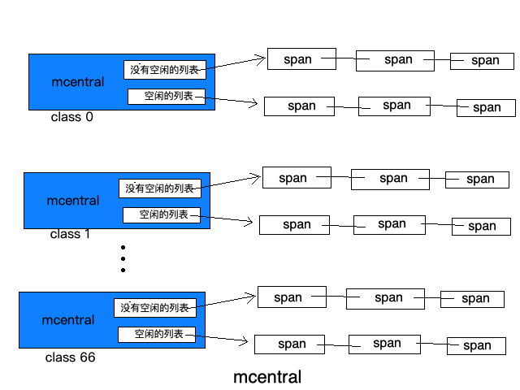

每个`mcentral`都会包含两个`mspan`的列表：
+ 没有空闲对象或`mspan`已经被`mcache`缓存的`mspan`列表(`empty mspanList`)
+ 有空闲对象的`mspan`列表(`empty mspanList`)

由于`mspan`是全局的，会被所有的`mcache`访问，所以会出现并发性问题，因而`mcentral`会存在一个锁。

单个`mcentral`结构：
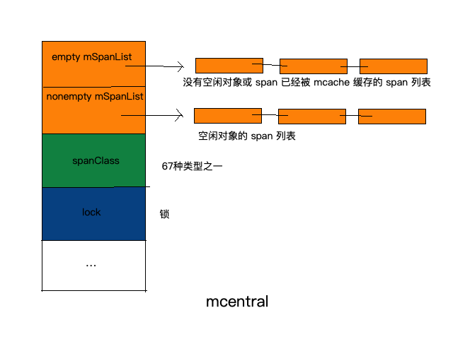

`mheap`可以认为是Go程序持有的整个堆空间，`mheap`全局唯一，可以认为是个全局变量。<br/>
`mheap`包含了除了上文中讲的`mcache`之外的一切。<br/>
仔细观察，可以发现`mheap`中也存在一个锁lock。这个lock是作用是什么呢？<br/>
我们知道，大于`32K`的对象被定义为大对象，直接通过`mheap` 分配。这些大对象的申请是由`mcache`发出的，而`mcache`在`P`上，程序运行的时候往往会存在多个`P`，因此，这个内存申请是并发的；所以为了保证线程安全，必须有一个全局锁。<br/>
假如需要分配的内存时，`mheap`中也没有了，则向操作系统申请一系列新的页`page`（最小`1MB`）。

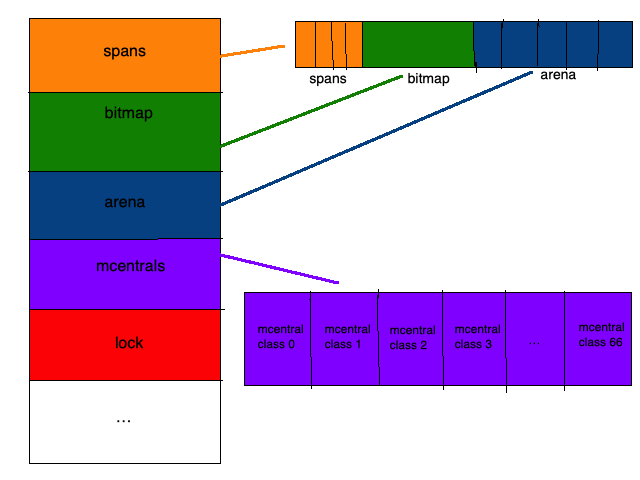

### 内存分配总结
对象分三种：
+ 微小对象，size < 16B
+ 一般小对象，16B < size <= 32k
+ 大对象，size > 32k

分配方式分三种：
+ tinny allocations (size < 16B，no pointers) 微型分配器分配。
+ small allocations ( size <= 32k) 正常分配；首先通过计算使用的大小规格，然后使用`mcache`中对应大小规格的块分配
+ large allocations (size > 32k) 大对象分配；直接通过`mheap`分配。这些大对象的申请是以一个全局锁为代价的，因此任何给定的时间点只能同时供一个 P 申请。

对象分配：
+ size范围在在( size < 16B)，不包含指针的对象。 `mcache`上的微型分配器分配
+ size范围在(0 < size < 16B)， 包含指针的对象：正常分配
+ size范围在(16B < size <= 32KB): 正常分配
+ size范围在( size > 32KB): 大对象分配

分配顺序：
+ 首先通过计算使用的大小规格。
+ 然后使用`mcache`中对应大小规格的块分配。
+ 如果`mcentral`中没有可用的块，则向`mheap`申请，并根据算法找到最合适的`mspan`。
+ 如果申请到的`mspan`超出申请大小，将会根据需求进行切分，以返回用户所需的页数。剩余的页构成一个新的`mspan`放回`mheap`的空闲列表。
+ 如果`mheap`中没有可用`span`，则向操作系统申请一系列新的页（最小`1MB`）。

## 6. GC（未完成）
+ 标记清扫 Mark-sweep <br/>
  需要大量内存空间


+ 标记压缩 Mark-compact <br/>
  实现难，多次循环计算垃圾被压缩存放的位置


+ 半空间复制 Semispace-copy <br/>
  独立的压缩区域，不需要重复计算位置，但是内存存放垃圾的部分不能使用


+ 引用计数 Reference counting <br/>
  额外空间（对象头部），自依赖（自己引用自己）不会被回收 需要循环遍历，并发性（要加锁）


+ 分代回收 <br/>
  默认新对象更可能是垃圾，要维护新对象对老对象的引用

>Golang使用标记清扫

实现简单，malloc将大对象分解成小对象则不会有太多内存碎片，分代需要维护一些列表但是带来的好处很有限，因为有内存逃逸机制，新对象去栈，老对象去堆，就不需要分代了

GC特性：并发（和用户协程一起执行），增量（用增量方式使暂停时间短），准确式（精准区分数据类型）

标记准备：25%的时间

**标记清扫流程**<br/>
1. 初始状态：有黑白灰三个集合，初始时所有对象都是白色
2. 从Root对象开始标记，将所有可达对象标记为灰色
3. 从灰色对象集合取出对象，将其引用的对象标记为灰色，放入灰色集合，并将自己标记为黑色
4. 重复第三步，直到灰色集合为空，即所有可达对象都被标记
5. 标记结束后，不可达的白色对象即为垃圾，对内存进行迭代清扫，回收白色对象
6. 重置GC状态

**写屏障**<br/>
因为GC是异步的，所以在并发标记时，可能导致漏标记，而丢失对象。<br/>
比如：A -> nil, B -> C，此时GC，A被标记为黑，还未标记到B，然后发生传值，A -> C，B -> nil。
这样检测到B的时候，B正好指向nil，B被标记为黑，但是C没有被标记。于是C被回收，A的值就丢失了。<br/>
Go GC的写屏障（与内存写屏障是不同概念）是在写入指针前执行的一小段代码，在编译时加入。<br/>
写屏障在`mark`和`marktermination`阶段处于开启状态

**三色标记的实现**<br/>
“gcmarkBits”`runtime.markBits`用来标记三色，白色对象为0，灰色或黑色为1。灰色黑色是看是否在扫描队列`runtime.scanobject`中，在队列中为灰色，黑色会出队。

### GC流程
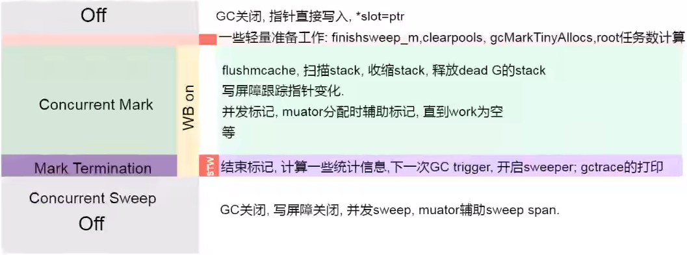
STW（stop the world) 暂停协程保证安全。

## 7. GPM（未完成）
OS线程（操作系统线程）一般都有固定的栈内存（通常为**4MB**）,一个goroutine的栈在其生命周期开始时只有很小的栈（典型情况下**2KB**），goroutine的栈不是固定的，他可以按需增大和缩小，goroutine的栈大小限制可以达到1GB，虽然极少会用到这么大。所以在Go语言中一次创建十万左右的goroutine也是可以的。

> GPM = goroutine processes machine

`GPM`是Go语言运行时（runtime）层面的实现，是go语言自己实现的一套调度系统。区别于操作系统调度OS线程。

+ `G`是goroutine，里面除了存放本goroutine信息外 还有与所在P的绑定等信息。
+ `P`管理着一组goroutine队列，P里面会存储当前goroutine运行的上下文环境（函数指针，堆栈地址及地址边界），P会对自己管理的goroutine队列做一些调度（比如把占用CPU时间较长的goroutine暂停、运行后续的goroutine等等）当自己的队列消费完了就去全局队列里取，如果全局队列里也消费完了会去其他P的队列里抢任务。
+ `M`（machine）是Go运行时（runtime）对操作系统内核线程的虚拟， M与内核线程一般是一一映射的关系， 一个groutine最终是要放到M上执行的。

P与M的关系是： P管理着一组G挂载在M上运行。当一个G长久阻塞在一个M上时，runtime会新建一个M，阻塞G所在的P会把其他的G 挂载在新建的M上。当旧的G阻塞完成或者认为其已经死掉时 回收旧的M。

+ M和P不是一一对应：一个M可以在不同的时间绑定到不同的P上。P相当于一个执行环境，M相当于一个实际执行单位。当一个M需要执行Goroutine时，它会首先获取一个P，并在该P上执行Goroutine。 
+ P和G的关系：一个P可以有多个Goroutine排队等待执行，但在任何时刻只有一个Goroutine在该P上运行。 
+ M和G的关系：一个M在任何时刻只能执行一个Goroutine，但一个Goroutine的执行可以在不同的M上切换。

P的个数是通过`runtime.GOMAXPROCS`设定（最大256），Go1.5版本之后默认为物理线程数。 在并发量大的时候会增加一些P和M，但不会太多，切换太频繁的话得不偿失。

单从线程调度讲，Go语言相比起其他语言的优势在于OS线程是由OS内核来调度的，goroutine则是由Go运行时（runtime）自己的调度器调度的，这个调度器使用一个称为m:n调度的技术（复用/调度m个goroutine到n个OS线程）。 其一大特点是goroutine的调度是在用户态下完成的， 不涉及内核态与用户态之间的频繁切换，包括内存的分配与释放，都是在用户态维护着一块大的内存池， 不直接调用系统的malloc函数（除非内存池需要改变），成本比调度OS线程低很多。 另一方面充分利用了多核的硬件资源，近似的把若干goroutine均分在物理线程上， 再加上本身goroutine的超轻量，以上种种保证了go调度方面的性能。

**GPM结构**：
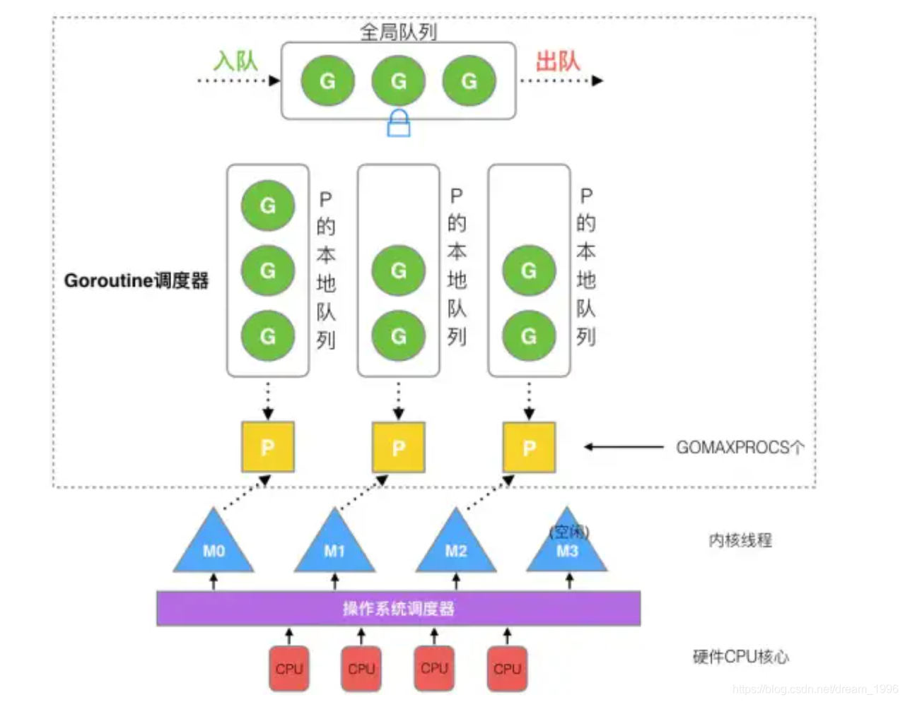

线程成本高主要表现在以下两个方面：

1. 调度的高消耗CPU；操作系统线程的创建和切换都需要进入内核，都会占用很长时间，导致CPU有很大的一部分时间都被用来进行进程调度了
2. 高内存占用；内核在创建操作系统线程时默认会为其分配一个较大的栈内存(进程虚拟内存会占用4GB[32位操作系统], 而线程也要大约4MB)

而相对的，用户态的goroutine则轻量得多：

1. goroutine是用户态线程，创建和切换都在用户代码中完成而无需进入操作系统内核
2. goroutine启动时默认栈大小只有2k，可自动调整容量，可达1GB

**调度流程**：
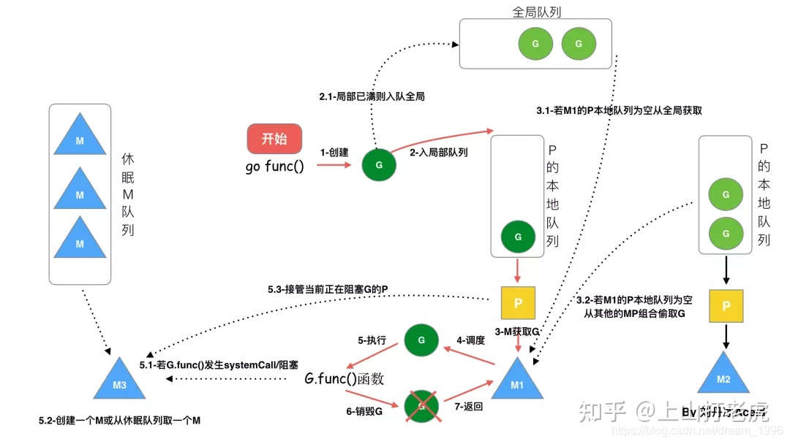

（G状态流转，栈扩容，合作式抢占，sysmon，P状态流转，M的spin和unspin，LockOSThread）

goroutine会在GC的STW和栈扫描阶段进行抢占

## 8. runtime包
职责：
+ 协程调度，内存分配，GC
+ 操作系统及CPU相关的操作的封装（信号处理，系统调度，寄存器操作，原子操作等），cgo
+ pprof， trace，race检测的支持
+ map，channel， string等内置类型及反射的实现

`runtime.Gosched()` 让CPU让出时间片

`runtime.Goexit()` 退出goroutine

`runtime.GOMAXPROCS(n)` 设置使用多少个CPU核心并行

## 9. reflect包
反射是指在程序运行期对程序本身进行访问和修改的能力。

```go
t := reflect.TypeOf(x) //返回x的类型对象，其类型为reflect.Type
t.Name() //返回x的类型名称
t.Kind() //返回x的底层（原始）类型名称
v := reflect.ValueOf(x) //返回x的原始值对象，其类型为reflect.Value
v.Kind() //通过原始值对象v返回x的底层（原始）类型名称
```

想要在函数中通过反射修改变量的值，需要注意函数参数传递的是值拷贝，必须传递变量地址才能修改变量值。而反射中使用专有的`Elem()`方法来获取指针对应的值。
```go
v := reflect.ValueOf(x)
if v.Elem().Kind() == reflect.Int64 {
    v.Elem().SetInt(200)
}
```

isNil()
```go
func (v Value) IsNil() bool
```
`IsNil()`报告v持有的值是否为nil。v持有的值的分类必须是通道、函数、接口、映射、指针、切片之一；否则IsNil函数会导致panic。
isValid()
```go
func (v Value) IsValid() bool
```
`IsValid()`返回v是否持有一个值。如果v是Value零值会返回假，此时v除了IsValid、String、Kind之外的方法都会导致panic。
```go
// *int类型空指针
var a *int
fmt.Println("var a *int IsNil:", reflect.ValueOf(a).IsNil())
// nil值
fmt.Println("nil IsValid:", reflect.ValueOf(nil).IsValid())
// 实例化一个匿名结构体
b := struct{}{}
// 尝试从结构体中查找"abc"字段，有字段就返回true，不管是不是0值
fmt.Println("不存在的结构体成员:", reflect.ValueOf(b).FieldByName("abc").IsValid())
// 尝试从结构体中查找"abc"方法
fmt.Println("不存在的结构体方法:", reflect.ValueOf(b).MethodByName("abc").IsValid())
// map
c := map[string]int{}
// 尝试从map中查找一个不存在的键
fmt.Println("map中不存在的键：", reflect.ValueOf(c).MapIndex(reflect.ValueOf("abc")).IsValid())
```

### 结构体反射

| 方法	| 说明 |
|:------|:------------------------|
| Field(i int) StructField	| 根据索引，返回索引对应的结构体字段的信息。|
| NumField() int	| 返回结构体成员字段数量。|
| FieldByName(name string) (StructField, bool)	| 根据给定字符串返回字符串对应的结构体字段的信息。|
| FieldByIndex(index []int) StructField	| 多层成员访问时，根据 []int | 提供的每个结构体的字段索引，返回字段的信息。|
| FieldByNameFunc(match func(string) bool) (StructField,bool)	| 根据传入的匹配函数匹配需要的字段。|
| NumMethod() int	| 返回该类型的方法集中方法的数目|
| Method(int) Method	| 返回该类型方法集中的第i个方法|
| MethodByName(string)(Method, bool)	| 根据方法名返回该类型方法集中的方法|

`StructField`类型用来描述结构体中的一个字段的信息。
```go
type StructField struct {
    // Name是字段的名字。PkgPath是非导出字段的包路径，对导出字段该字段为""。
    // 参见http://golang.org/ref/spec#Uniqueness_of_identifiers
    Name    string
    PkgPath string
    Type      Type      // 字段的类型
    Tag       StructTag // 字段的标签
    Offset    uintptr   // 字段在结构体中的字节偏移量
    Index     []int     // 用于Type.FieldByIndex时的索引切片
    Anonymous bool      // 是否匿名字段
}
```

## 10. context包
注意：
+ Context是线程安全的，可以放心的在多个goroutine中传递。
+ 以Context作为参数的函数方法，应该把Context作为第一个参数。
+ 给一个函数方法传递Context的时候，不要传递`nil`，如果不知道传递什么，就使用`context.TODO()` 
+ Context的`Value`相关方法应该传递请求域的必要数据，不应该用于传递可选参数。

接口
```go
type Context interface {
    Deadline() (deadline time.Time, ok bool)
    Done() <-chan struct{}
    Err() error
    Value(key interface{}) interface{}
}
```
+ `Deadline`方法需要返回当前`Context`被取消的时间，也就是完成工作的截止时间（`deadline`）；
+ `Done`方法需要返回一个`Channel`，这个`Channel`会在当前工作完成或者上下文被取消之后关闭，多次调用`Done`方法会返回同一个`Channel`；
+ `Err`方法会返回当前`Context`结束的原因，它只会在`Done`返回的`Channel`被关闭时才会返回非空的值；
  + 如果当前`Context`被取消就会返回`Canceled`错误；
  + 如果当前`Context`超时就会返回`DeadlineExceeded`错误；
+ `Value`方法会从`Context`中返回键对应的值，对于同一个上下文来说，多次调用`Value`并传入相同的Key会返回相同的结果，该方法仅用于传递跨API和进程间跟请求域的数据。

方法
+ Background：返回context根对象
+ TODO：给一个函数方法传递`Context`的时候，不要传递`nil`，如果不知道传递什么，就使用`context.TODO()`
+ WithCancel: `func WithCancel(parent Context) (ctx Context, cancel CancelFunc)`
+ WithDeadline: `func WithDeadline(parent Context, deadline time.Time) (Context, CancelFunc)`
+ WithTimeout: `func WithTimeout(parent Context, timeout time.Duration) (Context, CancelFunc)`
+ WithValue: `func WithValue(parent Context, key, val interface{}) Context`

WithDeadline 和 WithTimeout 的区别
+ `WithDeadline` 给`context`设置失效时间，如果`ctx`过期后`ctx.Done()`会先收到到期通知，返回`ctx.Err()`
+ `WithTimeout` 给`context`的`ctx.Done()`设置延迟时间，在延迟后自动执行`ctx.Done()`
```go
var wg sync.WaitGroup

func worker(ctx context.Context) {
LOOP:
  for {
    fmt.Println("worker")
    time.Sleep(time.Second)
    select {
    case <-ctx.Done(): // 等待上级通知
      break LOOP
    default:
    }
  }
  wg.Done()
}

func main() {
  ctx, cancel := context.WithCancel(context.Background())
  wg.Add(1)
  go worker(ctx)
  time.Sleep(time.Second * 3)
  cancel() // 通知子goroutine结束
  wg.Wait()
  fmt.Println("over")
}
```

## 11. atomic包
线程安全

| 方法	                                                                                                                                                                                                                                                                                                                                                                                          | 解释    |
|:---------------------------------------------------------------------------------------------------------------------------------------------------------------------------------------------------------------------------------------------------------------------------------------------------------------------------------------------------------------------------------------------|:------|
| func LoadInt32(addr *int32) (val int32) <br/> func LoadInt64(addr *int64) (val int64) <br/>func LoadUint32(addr *uint32) (val uint32) <br/> func LoadUint64(addr *uint64) (val uint64) <br/> func LoadUintptr(addr *uintptr) (val uintptr) <br/> func LoadPointer(addr *unsafe.Pointer) (val unsafe.Pointer)                                                                                 | 读取操作  |
| func StoreInt32(addr *int32, val int32) <br/> func StoreInt64(addr *int64, val int64) <br/> func StoreUint32(addr *uint32, val uint32) <br/> func StoreUint64(addr *uint64, val uint64) <br/> func StoreUintptr(addr *uintptr, val uintptr) <br/> func StorePointer(addr *unsafe.Pointer, val unsafe.Pointer)                                                                                | 写入操作  |
| func AddInt32(addr *int32, delta int32) (new int32) <br/> func AddInt64(addr *int64, delta int64) (new int64) <br/> func AddUint32(addr *uint32, delta uint32) (new uint32) <br/> func AddUint64(addr *uint64, delta uint64) (new uint64) <br/> func AddUintptr(addr *uintptr, delta uintptr) (new uintptr)                                                                                  | 修改操作 |
| func SwapInt32(addr *int32, new int32) (old int32) <br/> func SwapInt64(addr *int64, new int64) (old int64) <br/> func SwapUint32(addr *uint32, new uint32) (old uint32) <br/> func SwapUint64(addr *uint64, new uint64) (old uint64) <br/> func SwapUintptr(addr *uintptr, new uintptr) (old uintptr) <br/> func SwapPointer(addr *unsafe.Pointer, new unsafe.Pointer) (old unsafe.Pointer) | 交换操作 |
| func CompareAndSwapInt32(addr *int32, old, new int32) (swapped bool) <br/> func CompareAndSwapInt64(addr *int64, old, new int64) (swapped bool) <br/> func CompareAndSwapUint32(addr *uint32, old, new uint32) (swapped bool) <br/> func CompareAndSwapUint64(addr *uint64, old, new uint64) (swapped bool) <br/> func CompareAndSwapUintptr(addr *uintptr, old, new uintptr) (swapped bool) <br/> func CompareAndSwapPointer(addr *unsafe.Pointer, old, new unsafe.Pointer) (swapped bool) | 比较并交换操作 |

## 12. 性能调优
pprof， trace，race
https://www.liwenzhou.com/posts/Go/performance_optimisation/

## 13. 浏览器跨域
跨域只在使用浏览器进行访问时出现，而服务器对服务器的请求是不会出现跨域问题的。

跨域问题的解决方法：

| 方法               | 简介                                                                                                                     | 优点                                                | 缺点                                                                    |
|:-----------------|:-----------------------------------------------------------------------------------------------------------------------|:--------------------------------------------------|:----------------------------------------------------------------------|
| `JsonP`          | 传参一个回调函数名给后端，后端返回时即时执行这个在前端定义的回调函数                                                                                     | 前端代码简单                                            | 安全问题<br/><br/> 后端需拼接回调函数和参数的字符串，高耦合<br/><br/> 请求失败难以跟踪                |
| `代理服务器`          | 利用http包，将客户端请求外层包裹一层创建服务器的代码，这样本地客户端就相当于存在一个server，发送请求时，本地客户端对本地代理服务器发送请求，代理服务器再对外部服务器发送请求。                           | 后端无需加任何代码 <br/> <br/>前后端低耦合                       | 前端需要大量代码封装，以避免回调地狱 <br/><br/> 前端业务逻辑复杂，有进有出 <br/><br/> 代理服务器端口占用时无法使用 |
| `CORS中间件`和`反向代理` | 后端添加`CORS中间件`修改响应头，设置白名单mapping进行判断，handler代码可以动态添加是否允许跨域，或者在中间件中允许该地址所有请求通过。<br/><br/> 反向代理方式就是将跨域配置请求头加入到反向代理服务器代码中。 | 前端无需考虑跨域 <br/><br/> 耦合最低 <br/><br/> 后端可动态配置是否允许跨域 | 后端代码量大                                                                |                                                                |
| `iframe`         | `document.domain + iframe`(主域需相同) `location.hash + iframe` `window.name + iframe` 增加用来发送请求的iframe，并利用不同方式传递响应参数        | 后端无需考虑跨域 | 前端代码复杂 <br/><br/> 全局变量重名问题，管理困难或配置复杂                                  |
| `Web Socket`     | 利用TCP协议                                                                                                                | 双向通信                                              | 只有支持`ws://`的服务器才能使用                                                   |

