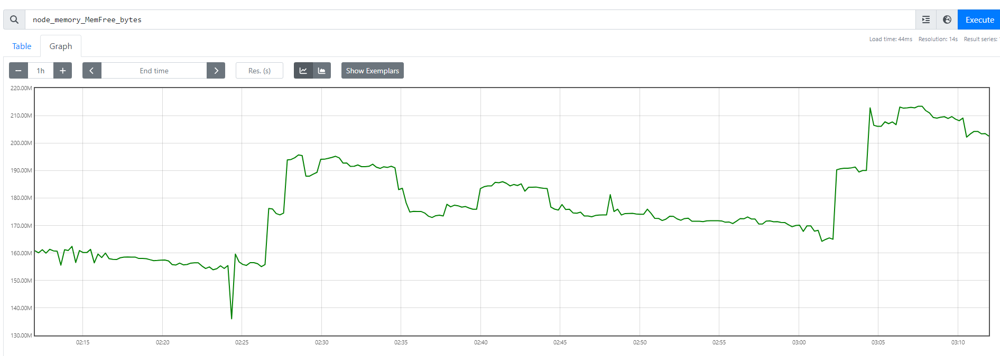
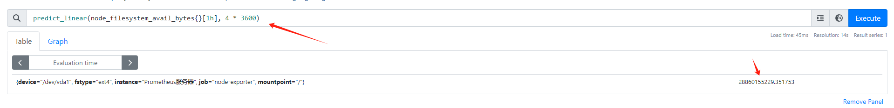
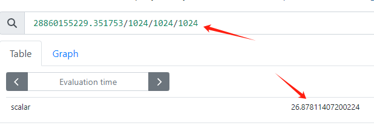
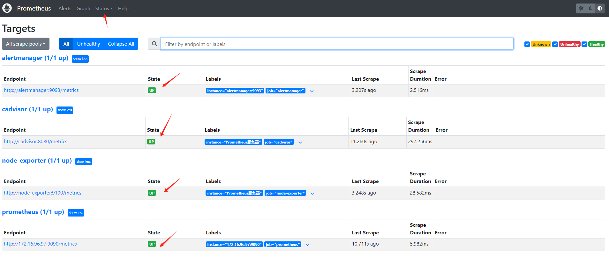
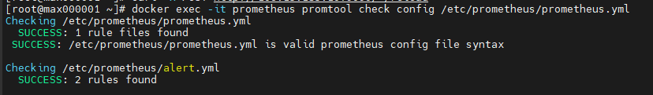

# Prometheus基本概念

<!-- TOC -->
* [Prometheus基本概念](#prometheus)
  * [1. 时间序列](#1-)
  * [2. 样本](#2-)
    * [2.1 指标](#21-)
    * [2.2 Counter](#22-counter)
    * [2.3 Gauge](#23-gauge)
    * [2.4 Histogram和Summary](#24-histogramsummary)
  * [3. Job任务和Instance实例](#3-jobinstance)
  * [4. Exporter](#4-exporter)
    * [4.1 Exporter来源](#41-exporter)
    * [4.2 Exporter类型](#42-exporter)
    * [4.3 Exporter规范](#43-exporter)
  * [5. 监控Nginx](#5-nginx)
    * [5.1 准备工作](#51-)
    * [5.2 安装和配置nginx exporter](#52-nginx-exporter)
    * [5.3 常用指标](#53-)
    * [5.4 配置报警器](#54-)
    * [5.5 配置面板](#55-)
<!-- TOC -->

## 1. 时间序列

> https://宿主机外网IP:9090/metrics

```promql
# HELP process_open_fds Number of open file descriptors.
# TYPE process_open_fds gauge
process_open_fds 29
```

Prometheus会将所有采集到的监控样本数据以时间序列的方式保存在**内存数据库**中，并定时保存到硬盘上。时间序列是按照时间戳和值顺序存放的，称之为向量vector，每条时间序列通过指标名称 metrics name 和一组标签集label命名

## 2. 样本

时间序列中的每一个点为一个样本sample，样本由3部分构成：
+ 指标metric：指标名和描述当前样本特征的标签集合
+ 时间戳timestamp：精确到毫秒
+ 样本值value：一个float64的浮点型数据表示当前样本的值

```promql
process_open_fds{instance="172.16.96.97:9090", job="prometheus"} @1434417560938  39
```

### 2.1 指标

+ 指标名metric name反映被监控样本的含义
+ 标签label反映了当前样本的特征维度，可以通过标签进行过滤聚合等操作

```promql
process_open_fds{instance="172.16.96.97:9090", job="prometheus"}
```
等同于
```promql
{__name__="process_open_fds",instance="172.16.96.97:9090",job="prometheus"}
```

指标的4种类型：
+ 计数器 counter
+ 仪表盘 gauge
+ 直方图 histogram
+ 摘要 summary

> gauge和counter是数值指标，代表数据的变化情况；histogram和summary是统计类型指标，表示数据的分布情况。

在exporter返回的赝本数据中，其注释包含了该样本的类型，例如：
```promql
# HELP process_virtual_memory_bytes Virtual memory size in bytes.
# TYPE process_virtual_memory_bytes gauge
process_virtual_memory_bytes 1.787527168e+09
```

### 2.2 Counter

只增不减的计数器，常见指标，http_requests_total, node_cpu，一般定义counter名称时推荐使用`_total`作为后缀

例如，通过PromQL内置的聚合函数rate()获取http请求量的评价增长率：
```promql
rate(prometheus_http_requests_total[5m])
```
查询当前系统中，访问量前十的http地址：
```promql
topk(10, prometheus_http_requests_total)
```

### 2.3 Gauge

可增可减的仪表盘，侧重于反映系统的当前状态，例如， node_memory_MemFree_bytes 主机当前空闲的物理内存大小，node_memory_MemAvailable_bytes 可用内存大小

```promql
node_memory_MemFree_bytes
```


PromQL内置函数delta()可以获取样本在一段时间内的变化情况。例如，计算CPU温度在两个小时内的差异:
```promql
delta(cpu_temp_celsius{host="zeus"}[2h])
```

可以使用deriv()计算样本的线性回归模型，甚至是直接使用predict_linear()对数据的变化趋势进行预测。例如，预测系统磁盘空间在4个小时后的剩余情况：
```promql
predict_linear(node_filesystem_avail_bytes{}[1h], 4 * 3600)
```




### 2.4 Histogram和Summary

用于统计和分析样本的分布情况。例如，排查长尾问题。

```promql
# HELP prometheus_rule_evaluation_duration_seconds The duration for a rule to execute.
# TYPE prometheus_rule_evaluation_duration_seconds summary
prometheus_rule_evaluation_duration_seconds{quantile="0.5"} 0.00025282
prometheus_rule_evaluation_duration_seconds{quantile="0.9"} 0.000341315
prometheus_rule_evaluation_duration_seconds{quantile="0.99"} 0.000416622
prometheus_rule_evaluation_duration_seconds_sum 0.881417
```
上面例子，每行结尾是耗时，最后一行是总耗时

Histogram同理，与summary的直观区别是：`_bucket`和`le`
```promql
# HELP prometheus_tsdb_tombstone_cleanup_seconds The time taken to recompact blocks to remove tombstones.
# TYPE prometheus_tsdb_tombstone_cleanup_seconds histogram
prometheus_tsdb_tombstone_cleanup_seconds_bucket{le="0.005"} 0
prometheus_tsdb_tombstone_cleanup_seconds_bucket{le="0.01"} 0
prometheus_tsdb_tombstone_cleanup_seconds_bucket{le="0.025"} 0
prometheus_tsdb_tombstone_cleanup_seconds_bucket{le="0.05"} 0
prometheus_tsdb_tombstone_cleanup_seconds_bucket{le="0.1"} 0
prometheus_tsdb_tombstone_cleanup_seconds_bucket{le="0.25"} 0
prometheus_tsdb_tombstone_cleanup_seconds_bucket{le="0.5"} 0
prometheus_tsdb_tombstone_cleanup_seconds_bucket{le="1"} 0
prometheus_tsdb_tombstone_cleanup_seconds_bucket{le="2.5"} 0
prometheus_tsdb_tombstone_cleanup_seconds_bucket{le="5"} 0
prometheus_tsdb_tombstone_cleanup_seconds_bucket{le="10"} 0
prometheus_tsdb_tombstone_cleanup_seconds_bucket{le="+Inf"} 0
prometheus_tsdb_tombstone_cleanup_seconds_sum 0
prometheus_tsdb_tombstone_cleanup_seconds_count 0
```

特别注意，假设采样数据metric叫做x，如果x是histogram或summary类型，必须满足以下条件：
+ 采样数据的总和应表示为`x_sum`
+ 采样数据的总量应表示为`x_count`
+ `summary`类型的采样数据的`quantile`应表示为`x{quantile="y"}`
+ `histogram`类型的采样分区统计数据应表示为`x_bucket{le="y"}`
+ `histogram`类型的采样必须包含`x_bucket{le="+Inf"}`，它的值等于`x_count`的值
+ `summary`和`histogram`中`quantile`和`le`必须按从小到大的顺序排列

## 3. Job任务和Instance实例

在Prometheus中，任何被采集的目标，即每一个暴露监控样本数据的http服务，都成为一个实例instance，例如在当前主机上运行的 node exporter可以被称为一个实例，而具有相同采集目的的实力集合，称为 job

```
* job: node
  * instance 2: 1.2.3.4:9100
  * instance 4: 5.6.7.8:9100
```

在prometheus.yml配置文件中，添加如下配置。让prometheus可以从node exporter暴露的服务中获取监控指标数据。
```yml
scrape_configs:
  - job_name: 'node-exporter' # job
    scrape_interval: 15s
    static_configs:
      - targets: ['node_exporter:9100'] # instance
        labels:
          instance: Prometheus服务器
```
可以在prometheus中的`status` → `targets`中找到



## 4. Exporter

所有可以向Prometheus提供监控样本数据的程序都可以被称为一个 Exporter。Exporter的一个实例称为target

### 4.1 Exporter来源

社区：
> https://prometheus.io/docs/instrumenting/exporters/

| 范围     | 常用的Exporter                                                                               |
|:-------|:------------------------------------------------------------------------------------------|
| 数据库    | MySQL Exporter, Redis Exporter, MongoDB Exporter, MSSQL Exporter 等                        |
| 硬件     | Apcupsd Exporter, IoT Edison Exporter, IPMI Exporter, Node Exporter 等                     |
| 消息队列   | Beanstalkd Exporter, Kafka Exporter, NSQ Exporter, RabbitMQ Exporter 等                    |
| 存储     | Ceph Exporter, Gluster Exporter, HDFS Exporter, ScaleIO Exporter 等                        |
| HTTP服务 | Apache Exporter, HAProxy Exporter, Nginx Exporter 等                                       |
| API服务  | AWS ECS Exporter， Docker Cloud Exporter, Docker Hub Exporter, GitHub Exporter 等           |
| 日志     | Fluentd Exporter, Grok Exporter 等                                                         |
| 监控系统   | Collectd Exporter, Graphite Exporter, InfluxDB Exporter, Nagios Exporter, SNMP Exporter 等 |
| 其它     | Blockbox Exporter, JIRA Exporter, Jenkins Exporter, Confluence Exporter 等                 |

用户自定义：
使用prometheus提供的Client Library创建自己的exporter程序

### 4.2 Exporter类型

**直接采集型**

这类Exporter直接内置了相应的应用程序，用于向Prometheus直接提供Target数据支持。
这样的好处是，可以更好地监控各自系统的内部运行情况，同时也适合更多自定义监控指标的项目实施。
例如，cAdvisor、Kubernetes等，它们均内置了用于向Prometheus提供监控数据的端点。

**间接采集型**

原始监控目标并不直接支持Prometheus，需要我们使用Prometheus提供的Client Library编写该监控目标的监控采集程序，
用户可以将该程序独立运行，去获取指定的给类监控数据值。例如，由于linux操作系统自身不能直接支持Prometheus，
用户无法从操作系统层面上直接提供对Prometheus的支持，因此单独安装Node Exporter，还有数据库或网站HTTP应用类等Exporter。

### 4.3 Exporter规范

+ `#HELP`开头是帮助说明注释
+ `#TYPE`开头是指标类型说明
+ 非#开头，是监控样本数据

遵循 PromQL，例如：
```
# HELP prometheus_tsdb_wal_fsync_duration_seconds Duration of write log fsync.
# TYPE prometheus_tsdb_wal_fsync_duration_seconds summary
prometheus_tsdb_wal_fsync_duration_seconds{quantile="0.5"} NaN
prometheus_tsdb_wal_fsync_duration_seconds{quantile="0.9"} NaN
prometheus_tsdb_wal_fsync_duration_seconds{quantile="0.99"} NaN
prometheus_tsdb_wal_fsync_duration_seconds_sum 0.092663245
```

## 5. 监控Nginx

### 5.1 准备工作

检查是否安装 with-http_stub_status_module
```shell
docker exec -it nginx_main nginx -V 2>&l | grep -o with-http_stub_status_module
```

nginx开启stub_status配置
```nginx configuration
server {
    location /stub_status {
        stub_status on;
        access_log off;
        allow 0.0.0.0/0;
        deny all;
    }
}
```

```shell
# 重新加载配置
docker exec -it nginx_main nginx -s reload
# 检查是否正常
curl http://宿主机外网IP/stub_status
```

参数解释：
+ Active connections: 活动连接数
+ accepts: 接收请求数
+ handled: 成功处理请求数
+ requests: 总请求数
+ reading: 正在进行读操作的请求数
+ writing: 正在进行写操作的请求数
+ waiting: 正在等待的请求数

### 5.2 安装和配置nginx exporter

docker-compose 安装

访问地址，验证
> http://宿主机外网ip:9113/metrics

配置prometheus
```yaml
# 增加一个job
# 监控nginx
- job_name: 'nginx-exporter'
  scrape_interval: 15s
  static_configs:
    - targets: ['nginx_exporter:9113']
      labels:
        instance: Prometheus服务器Nginx
```

重新加载配置
```shell
curl -X POST http://宿主机ip:9090/-/reload
```

### 5.3 常用指标

+ nginx_connections_accepted  接收请求数
+ nginx_connections_active    活动连接数
+ nginx_connections_handled   成功处理请求数
+ nginx_connections_reading   正在进行读操作的请求数
+ nginx_connections_writing   正在进行写操作的请求数
+ nginx_connections_waiting   正在等待的请求数
+ nginx_connections_requests  总请求数

### 5.4 配置报警器

配置alert.yml
```yaml
groups:
  - name: Nginx
    rules:
      - alert: Nginx Down
        expr: nginx_up == 0
        for: 30s
        labels:
          severity: critical
        annotations:
          summary: "nginx异常,实例:{{ $labels.instance }}"
          description: "{{ $labels.job }} nginx已关闭"
```

检查配置
```shell
docker exec -it prometheus promtool check config /etc/prometheus/prometheus.yml
```


重新加载配置
```shell
curl -X POST http://宿主机ip:9090/-/reload
```

### 5.5 配置面板

> https://grafana.com/grafana/dashboards/12708

## 6. 告警系统

使用 Alertmanager

### 6.1 告警机制

+ 分组：将告警信息合并成一个通知，例如网络故障引发的多个服务宕机
+ 抑制：某一个告警后，其他引发的告警不会再发送
+ 静默：不发送告警

### 6.2 配置Alertmanager

见前面

