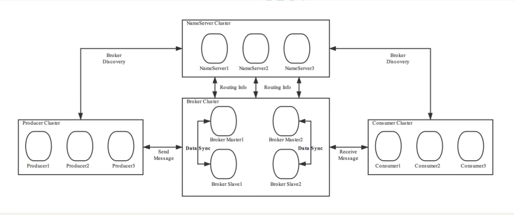
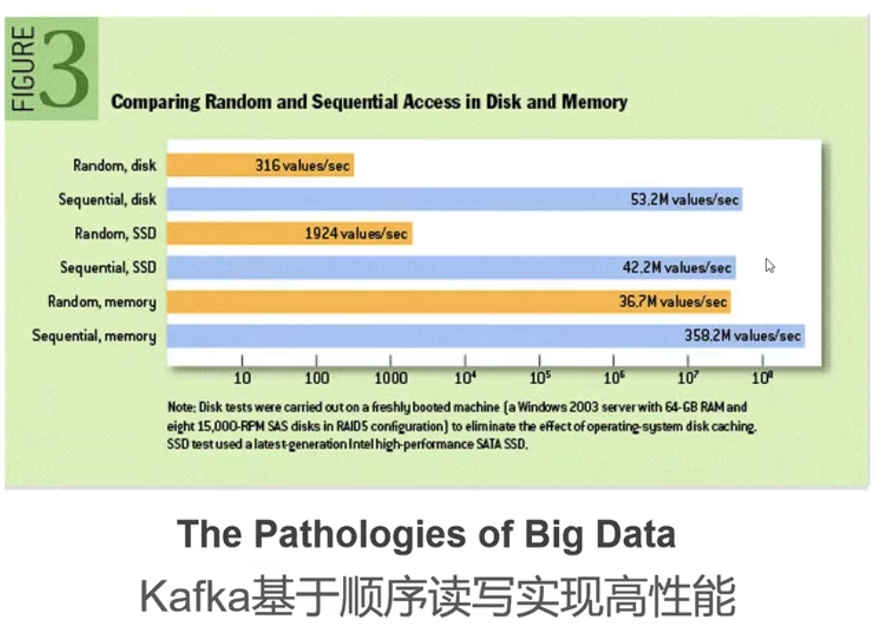
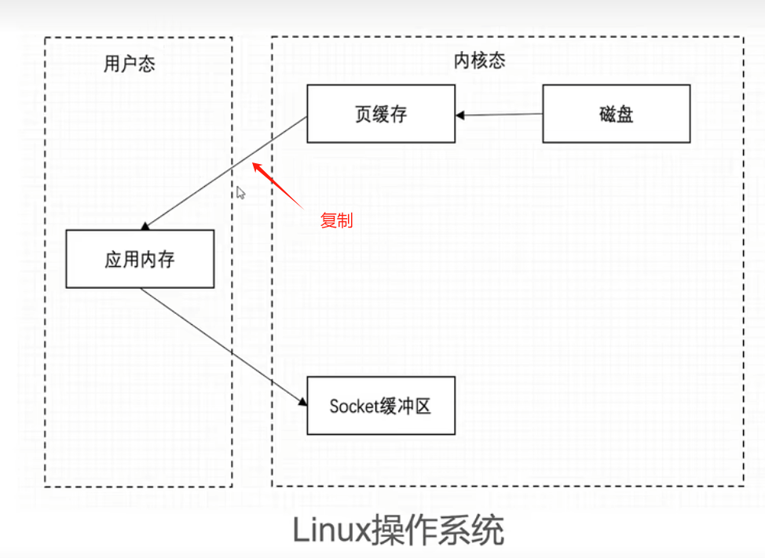
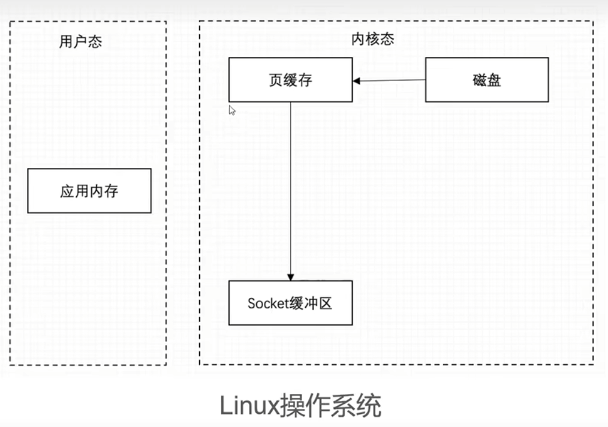

# RocketMQ

## 1. 概述
### 1.1 用途
+ 限流削峰
+ 异步解耦
+ 数据收集

### 1.2 对比
|    MQ    |    开发语言    | 特点                            |
|:--------:|:----------:|:------------------------------|
| ActiveMQ |    Java    | 早期，活跃度小                       |
| RabbitMQ |   Erlang   | 吞吐量较低                         |
|  Kafka   | Scala/Java | 吞吐率高，日志收集，大数据实时计算，存在硬盘但吞吐率也很高 |
| RocketMQ |    Java    | 性能问题，吞吐率高，自研协议                |

### 1.3 协议
+ JMS, java messaging service，ActiveMQ实现
+ STOMP, streaming text oriented message protocol, ActiveMQ实现，RabbitMQ可通过插件支持
+ AMQP, advanced message queuing protocol, RocketMQ自研
+ MQTT, message queuing telemetry transport, IBM自研即时通信协议，二进制协议，用于服务器和低功耗的IoT设备的通信，RabbitMQ可通过插件支持

## 2. 基本概念
+ 消息message：传输信息的物理载体，生产和消费数据的最消单位，每条消息必须属于一个主题
+ 主题topic：表示一类消息的集合，主题对消息是1对多，是进行消息订阅的基本单位。生产者可以发送多个topic，消费者只能订阅消费一个topic
+ 标签tag：区分同一主题下的topic
+ 队列queue：一个topic可以包含多个queue，每个queue中存放的是该topic的消息，一个topic的queue也被称为一个topic中消息的分区。一个topic的queue中的消息只能被一个消费者消费
+ 分片shard：存放相应topic的broker，topic的broker中的queue大小相同
+ 消息表示MessageId/Key：每个消息拥有唯一的MessageId，且可以携带具有业务标识的Key，方便查询。MessageId有两个：在生产者send()消息时会自动生成一个MessageId(msgId)，当消息到达broker后，broker也会自动生成一个MessageId(offsetMsgId)
    + msgId：由producer产成，规则为：
        `producerIp + 进程pid + MessageClientIDSetter类的classLoader的hashCode + 当前时间 + AutomaticInteger自增计数器`
    + offsetMsgId：由broker生成，规则为：
        `brokerIp + 物理分区的offset`
    + key：由用户指定的业务相关唯一标识

## 3. 系统架构

### 3.1 Producer
消息生产者，负责生产消息。Producer通过MQ的负载均衡模块选择相应的broker集群队列进行消息投递，投递的过程支持快速失败且低延迟。

RocketMQ中的消息生产者都是以生产者组(producer group)的形式出现。生产者组是同一类生产者的集合，这类producer发送相同topic类型的消息。

### 3.2 Consumer
消息消费者，负责消费消息。一个消息消费者会从broker服务器中获取到消息，并处理。

同样，Consumer group。同一个group则消费同一个topic类型的消息。

### 3.3 Name Server
NameServer是一个broker与topic路由的注册中心，支持broker的动态注册与发现

主要功能：
+ Broker管理：接收broker集群的注册信息并保存，作为路由信息的基本数据；提供信条检测机制
+ 路由信息管理：每个NameServer中都保存着broker集群的整个路由信息和用于客户端查询的队列信息。Producer和Consumer通过NameServer可以获取整个broker集群的路由信息，从而进行消息投递和消费。

### 3.4 Broker
Broker充当消息中转角色，负责存储消息、转发消息。

在RocketMQ中负责接收并储存从生产者发送来的消息，同时为消费者的拉取请求做准备。同时也存储meta数据，包括消费者组消费进度偏移offset、主题、队列等。

分主从节点，0是master，非0是slave。相同的BrokerName，不同的BrokerId。master负责读写，slave只读。每个broker与NameServer集群中的所有节点建立长连接，定时注册topic信息到所有NameServer。

### 3.5 工作流程
1. 启动NameServer，启动后开始监听端口，等待Broker、Producer、Consumer连接
2. 启动Broker时，Broker会与所有的NameServer建立并保持长连接，然后每30秒向NameServer定时发送心跳检查
3. 发送消息前，可以先创建topic，创建topic时，需要指定该topic需要存储在哪些broker上，当然，在创建topic时也会将topic与broker的关系写入NameServer中。这步是可选的，也可以在发送消息时，自动创建topic
4. Producer发送消息，启动时先跟NameServer集群中的其中一台建立长连接，并从NameServer中获取路由信息，即当前发送的topic的queue与broker地址(ip+port)的映射关系。然后根据算法策略从队列组选择一个queue，与队列所在的broker建立长连接从而向broker发消息。当然，在获取到路由信息后，producer会首先将路由信息缓存到本地，再每30秒从NameServer更新一次路由信息。
5. Consumer类似，跟其中一台NameServer建立长连接，获取其所订阅的topic的路由信息，然后根据算法策略从路由信息中获取其索要消费的queue，然后直接跟broker建立长连接，开始消费其中的消息。Consumer在获取到路由信息后，同样也会每30秒从NameServer更新一次路由信息。不过不同于producer的是，Consumer还会向broker发送心跳，以确保broker的存活状态

**Topic的手动创建有两种模式**
+ 集群模式：该模式下创建的topic在该集群中所有broker中的queue数量是相同的
+ Broker模式：该模式下创建的topic在该集群中，每个broker中的queue数量可以不同

> 自动创建topic时，默认采用的事broker模式，会为每个broker默认创建4个queue

**读/写队列**

从物理上讲，读/写队列是同一个队列。所以不存在读/写队列数据同步问题。

读/写队列是逻辑上进行区分的概念。一般情况下，读/写队列数量是相同的。

不一样的情况：

例如，创建Topic时，设置的写队列数量是8，读队列数量是4，此时系统会创建8个queue，分别是0 1 2 3 4 5 6 7。Producer会讲消息写入到这8个队列，
但consumer只会消费只会消费0 1 2 3这4个队列中的消息，4 5 6 7中的消息是不会被消费的。

这样设计的目的是为了方便topic的queue的缩容。

例如，原来创建的topic中包含16个queue，如何能够使其queue缩容为8，还不会丢失消息？可以动态修改写队列数量为8。
此时新消息只能写入到前8个队列，而consumer要消费16个队列，当发现后8个queue中的消息消费完毕后，就可以再将读队列数量动态设置为8。整个缩容过程，没有消息丢失。

perm用于设置对当前创建topic的操作权限：2表示只写，4表示只读，6表示读写。

## 4. Kafka为什么快

+ 磁盘顺序读写
+ 页缓存
+ 零拷贝
+ 批量操作

机械硬盘顺序读写甚至比固态硬盘顺序读写快

删除数据会破坏顺序，但是kafka不急着删除数据，而是基于某一规则（可能是时间等）统一删除，提高效率

页缓存：是保存数据的基本单位，在内存中缓存磁盘页

kafka避免使用JVM，避免了GC的消耗，同时字节紧密存储，避免了数据的对象化（没有产生对象），进一步提高空间利用率

拷贝发生在页缓存到应用缓存的过程中，而kafka中直接放入socket缓冲区

批量操作：有大量批处理API，可以统一压缩合并数据
