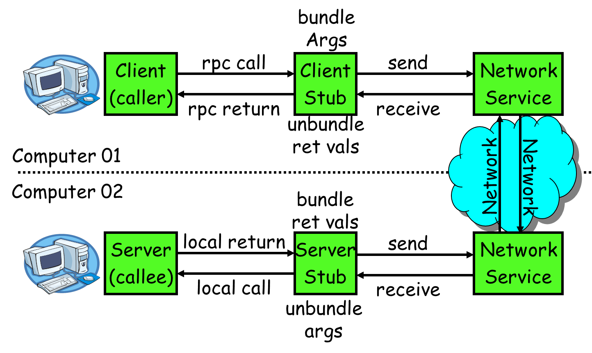

# RPC

<!-- TOC -->
* [RPC](#rpc)
  * [1. RPC四要素](#1-rpc)
  * [2. rpc包](#2-rpc)
  * [3. grpc + protobuf](#3-grpc--protobuf)
  * [4. protobuf数据类型](#4-protobuf)
  * [5. gRPC的4种请求模式](#5-grpc4)
<!-- TOC -->
----

## 1. RPC四要素


## 2. rpc包
客户端需要知道服务端的内部

## 3. grpc + protobuf

protobuf包下载
```shell
# protoc-gen-go
go get -u github.com/golang/protobuf/protoc-gen-go
# grpc
go get -u google.golang.org/grpc
# protobuf
go get -u google.golang.org/protobuf
```

生成stub调用代码
```shell
protoc -I . --go_out=plugins=grpc:. *.proto
```

## 4. protobuf数据类型

| .proto Type | Go Type | 对proto type的备注                           |
|:-----------:|:--------|:-----------------------------------------|
|   double    | float64 |                                          |
|    float    | float32 |                                          |
|    int32    | int32   | 使用变长编码，对于负值的效率很低，如果你的域有可能有负值，请使用sint64替代 |
|   uint32    | uint32  | 使用变长编码                                   |
|   uint64    | uint64  | 使用变长编码                                   |
|   sint32    | int32   | 使用变长编码，这些编码在负值时比int32高效的多                |
|   sint64    | int64   | 使用变长编码，有符号的整型值。编码时比通常的int64高效            |
|   fixed32   | uint32  | 总是4个字节，如果数值总是比总是比228大的话，这个类型会比uint32高效   |
|   fixed64   | uint64  | 总是8个字节，如果数值总是比总是比256大的话，这个类型会比uint64高效   |
|  sfixed32   | int32   | 总是4个字节                                   |
|  sfixed64   | int64   | 总是8个字节                                   |
|    bool     | bool    |                                          |
|   string    | string  | 一个字符串必须是UTF-8编码或者7-bit ASCII编码的文本        |
|   bytes     | []byte  | 可能包含任意顺序的字节数据                            |

## 5. gRPC的4种请求模式

1. 简单模式 unary
2. 服务端流式 server side streaming
3. 客户端流式 client side streaming
4. 双向流式 bidirectional streaming

示例：
```protobuf
service RouteGuide {
  // unary
  rpc GetFeature(Point) returns (Feature) {}
  // server side streaming
  rpc ListFeature(Rectangle) returns (stream Feature) {}
  // client side streaming
  rpc RecordRoute(stream Point) returns (RouteSummary) {}
  // bidirectional streaming
  rpc Recommend(stream RecommendationRequest) returns (stream Feature) {}
}
```